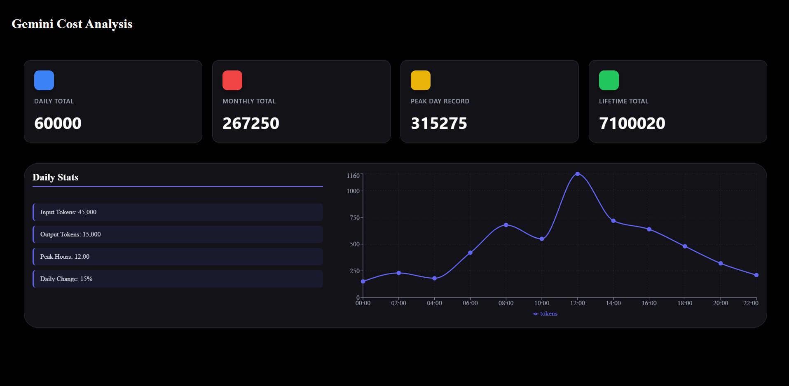

# Gemini Token Manager
A real-time token usage tracking and visualization system for managing Google Gemini API token limits with Redis/Python backend and React frontend.



## Features
- **Real-time Token Tracking**: Monitor token usage with live updates every 30 seconds
- **Daily Limit Management**: Automatically prevents API calls when approaching daily token limits
- **Usage Statistics**: Track daily, monthly, peak day, and lifetime token usage
- **Visual Analytics**: Interactive charts showing hourly token consumption patterns
- **Automatic Daily Reset**: Resets counters at UTC midnight with historical data archival
- **30-Day History**: Maintains rolling 30-day archive of token usage data

## Prerequisites
- Python 3.8+
- Node.js 14+
- Redis Server

## Installation

### 1. Redis Setup

**Windows:**
Download and install from [Redis for Windows](https://github.com/microsoftarchive/redis/releases)

**Mac:**
```bash
brew install redis
brew services start redis
```

**Linux:**
```bash
sudo apt-get install redis-server
sudo systemctl start redis
```
### 2. Backend Setup
```bash
# Navigate to backend folder
cd backend

# Install Python dependencies
pip install redis flask flask-cors google-generativeai

# Verify Redis connection
redis-cli ping
# Should return: PONG
```

### 3. Frontend Setup
```bash
# Navigate to frontend folder
cd frontend

# Install Node dependencies
npm install

# Install required packages
npm install recharts
```

### Backend Configuration (rtc.py)
```python
# Initialize RTCLimit with your settings
rtc = RTCLimit(
    host='localhost',      # Redis host
    port=6379,             # Redis port
    limit=1000000,         # Daily token limit (e.g., 1M for Gemini)
    db=0                   # Redis database number
)
```

### Frontend Configuration

Update API endpoint in `StatCard.jsx` and `Graph.jsx` if needed:
```javascript
const response = await fetch('http://localhost:5000/api/stats');
```

## Usage

### Starting the Application

**Terminal 1 - Start Redis (if not running as service):**
```bash
redis-server
```

**Terminal 2 - Start Flask Backend:**
```bash
cd backend
python flask_api.py
```
Backend runs on: `http://localhost:5000`

**Terminal 3 - Start React Frontend:**
```bash
cd frontend
npm start
```
Frontend runs on: `http://localhost:3000`

### Using the Token Limiter
```python
from rtc import RTCLimit


# Initialize
rtc = RTCLimit(host='localhost', port=6379, limit=1000000)

# Before making API call
input_tokens = 500  # Estimate from your prompt
if rtc.generate(input_tokens):
    # Proceed with API call
    response = model.generate_content(prompt)
    
    # After receiving response
    output_tokens = response.usage_metadata.candidates_token_count
    rtc.response_count(output_tokens)
else:
    print("Daily token limit reached!")
```

## API Endpoints

### GET /api/stats
Returns current statistics for stat cards.

**Response:**
```json
{
  "daily_total": 15000,
  "monthly_total": 450000,
  "peak_day": 25000,
  "lifetime_total": 2500000
}
```

### GET /api/token-usage
Returns hourly token usage data for charts.

**Response:**
```json
[
  {
    "hour": 14.5,
    "tokens": 5000,
    "timestamp": "2024-11-05 14:30:00"
  },
  {
    "hour": 15.0,
    "tokens": 7500,
    "timestamp": "2024-11-05 15:00:00"
  }
]
```

### GET /api/graph-stats
Returns stats for graph sidebar.

**Response:**
```json
{
  "input_tokens": 8000,
  "output_tokens": 7000,
  "peak_hours": "14:30",
  "daily_change": "+15.5%"
}
```

## Redis Data Structure

### Keys Used

| Key | Type | Description |
|-----|------|-------------|
| `date` | String | Current date (YY:MM:DD) |
| `token_usage` | Integer | Today's total tokens |
| `input_tokens` | Integer | Today's input tokens |
| `output_tokens` | Integer | Today's output tokens |
| `token_history` | JSON | Today's hourly data (max 100 points) |
| `token_archive` | JSON | Last 30 days of data |
| `monthly_tokens` | Integer | Current month's total |
| `lifetime_tokens` | Integer | All-time total |
| `peak_day_tokens` | Integer | Highest single-day usage |
| `yesterday_total` | Integer | Previous day's total |
| `current_month` | String | Current month (YY:MM) |

## Features Explained

### Daily Reset
Automatically triggers at UTC midnight:
- Archives previous day's data
- Updates monthly/lifetime totals
- Checks for new peak day record
- Resets daily counters to zero

### Token Limit Protection
- Configured buffer: 50,000 tokens below provider limit
- Blocks API calls when limit approached
- Prevents unexpected overage charges

### Data Retention
- **Today**: Full hourly breakdown (up to 100 data points)
- **Last 30 days**: Archived with daily totals and hourly data
- **Older than 30 days**: Automatically removed

### Auto-Refresh
Frontend polls backend every 30 seconds for live updates without page refresh.


## Project Structure
```
project/
├── backend/
│   ├── rtc.py              # Token limiter class
│   ├── flask_api.py        # REST API server
│   └── gemini_call.py      # Example usage
├── frontend/
│   ├── src/
│   │   ├── components/
│   │   │   ├── StatCard.jsx      # Stat cards component
│   │   │   ├── StatCard.module.css
│   │   │   ├── Graph.jsx         # Chart component
│   │   │   └── Graph.module.css
│   │   └── App.jsx
│   └── package.json
└── README.md
```


## Troubleshooting

### Redis Connection Error
```
Error: Connection refused
```
**Solution:** Ensure Redis is running
```bash
redis-cli ping
```

### CORS Error in Browser
```
Access to fetch blocked by CORS policy
```
**Solution:** Verify `flask-cors` is installed and CORS(app) is in flask_api.py

### Empty Chart
**Solution:** Make some API calls first to generate data, or check Redis has data:
```bash
redis-cli
> GET token_history
```

### Type Errors in Python
```
Type "ResponseT" is not assignable...
```
**Solution:** Ensure `decode_responses=True` is set in Redis initialization

## Performance

- **Memory Usage**: ~10MB for 30 days of data
- **Response Time**: <50ms for API calls
- **Refresh Rate**: 30-second intervals (configurable)
- **Redis Operations**: O(1) for reads/writes

## Customization

### Change Refresh Rate
In `StatCard.jsx` and `Graph.jsx`:
```javascript
const interval = setInterval(fetchStats, 30000); // 30 seconds
```

### Modify Y-axis Scale
In `Graph.jsx`:
```javascript
domain={[0, (dataMax) => Math.max(1000, dataMax)]}
// Change 1000 to your preferred minimum
```

### Adjust Archive Retention
In `rtc.py` `_archive_previous_day()`:
```python
if len(archive_list) > 30:  # Change 30 to desired days
    archive_list = archive_list[-30:]
```
Check gemini_call.py for setup example.

## License
MIT License - feel free to use and modify for your projects.

## Contributing

Contributions welcome! Please submit pull requests or open issues for bugs/features.

## Support

For issues or questions:
1. Check Redis is running: `redis-cli ping`
2. Verify both Flask and React are running
3. Check browser console for errors
4. Review Redis data: `redis-cli GET token_usage`

## Acknowledgments

- Built with Flask, React, and Redis
- Charts powered by Recharts
- Designed for Google Gemini API token management
